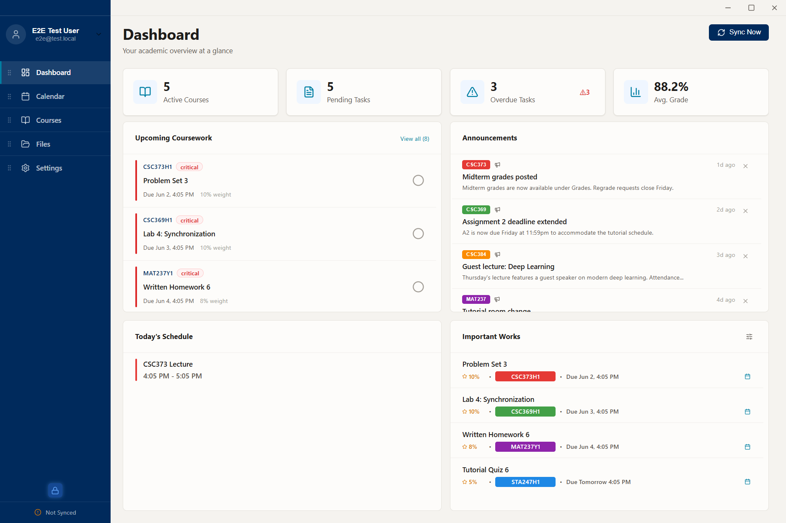
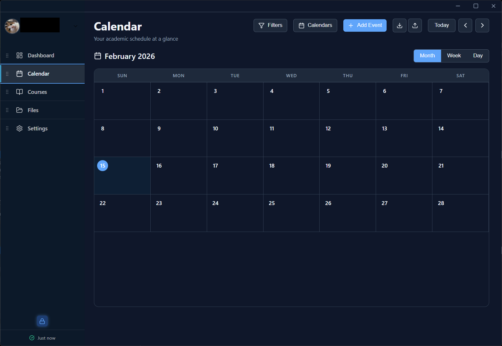
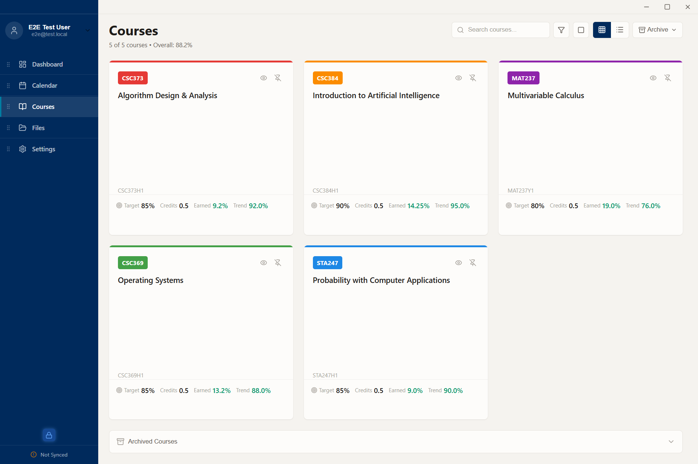
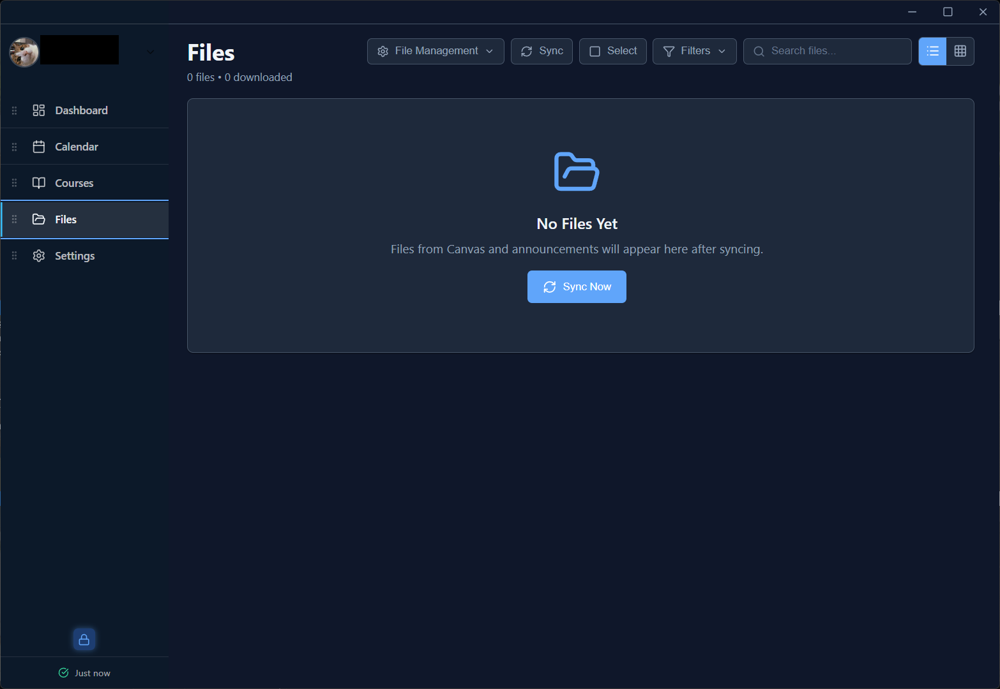
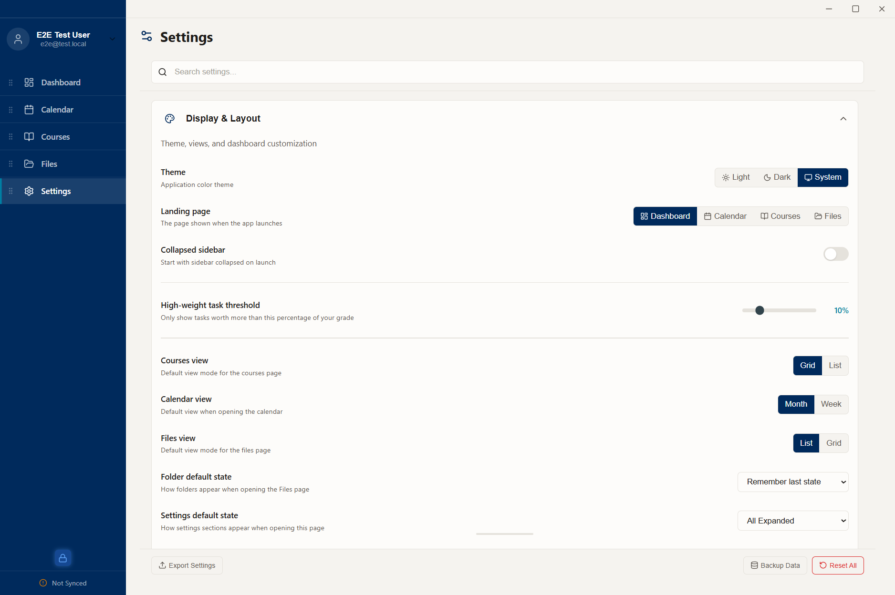

<div align="center">

# Canvas Assistant

**An offline-first desktop command center for Canvas LMS**

[](#installation)
[](LICENSE)
[](https://www.electronjs.org/)
[](https://react.dev/)
[](https://www.typescriptlang.org/)
[](https://www.sqlite.org/)

<p>
  Pull every course, assignment, grade, file, and announcement out of Canvas into one
  desktop window that <strong>works fully offline</strong> — and is built to be driven
  entirely from the keyboard.
</p>



</div>

---

## Table of Contents

- [Why Canvas Assistant](#why-canvas-assistant)
- [Features](#features)
- [Keyboard-first by design](#keyboard-first-by-design)
- [Screenshots](#screenshots)
- [Tech stack](#tech-stack)
- [Architecture](#architecture)
- [Testing](#testing)
- [Installation](#installation)
- [Getting started](#getting-started)
- [License](#license)

---

## Why Canvas Assistant

Canvas's web UI scatters your academic life across a dozen tabs — one for assignments,
another for grades, another for files, another for each course's announcements. Canvas
Assistant pulls all of it into a single desktop app, stores it locally in SQLite, and
keeps it usable when you're offline. Sync runs in the background; everything you've already
pulled stays readable on a plane, in a basement lecture hall, or with the Wi-Fi off.

It's **offline-first** (a local database is the source of truth, Canvas is the upstream),
**keyboard-first** (almost everything has a shortcut, discoverable with `?`), and
**privacy-respecting** (your data and Canvas token never leave your machine).

---

## Features

> For a page-by-page walkthrough with workflows and the less-obvious behaviors, see the
> **[User Guide](docs/USER-GUIDE.md)**.

### Dashboard — what needs your attention

A four-stat overview — active courses, pending tasks, overdue tasks, and your weighted
average grade — over a keyboard-navigable grid: a queue of tasks Canvas has pulled in for
you to triage, a recent-announcements feed, today's schedule, and your weighted
assignments. Click the average-grade stat for a per-course breakdown, or run a **grade
simulation** ("what if I get 95% on the final?") and watch the average update live.

### Calendar — plan your week or month

Month / week / day views of every deadline and Canvas event, color-coded by course. Filter
by course, task type, priority, or deadline status; create and edit your own events; and
export deadlines to an `.ics` file for any external calendar app.

### Courses — all your courses in one place

Grid or list view of your courses with current grade and progress. Search, filter by grade
range, pin the important ones, and **hide** or **archive** the rest (archived courses move
to their own collapsible section and stop appearing everywhere else). Open any course for a
detail page with its tasks, **grade history**, announcements, settings, and syllabus.

### Files — browse and download offline

A file browser that mirrors your Canvas folder structure: expand a course, walk its folders,
download what you need. Course **pages are cached locally** with their links rewritten to
local paths, so they stay readable with no network. Notification dots flag folders with
freshly-synced files.

### Updates — review everything that changed

Since your last sync: new grades, files, pages, and announcements on one side; tasks Canvas
queued for you on the other. **Resolve sync conflicts** (when a local edit clashes with a
Canvas change) and merge or link **duplicate tasks** — with "remember my choice" so the same
decision auto-applies next time.

### And the rest

- **Tasks** — every assignment across every course in one filterable, sortable list.
- **Announcements** — a searchable feed, filterable by course / type / read status.
- **Settings** — theme, academic target grade, sync cadence, notification triggers,
  download filters, **scheduled (optionally encrypted) backups**, and data retention.

> A note on honesty: an earlier version of this app had an "intelligence layer" that
> ranked tasks by a computed priority/ROI score. That subsystem was **removed** (it wasn't
> realistic for the target hardware — see
> [ADR-0003](docs/adr/0003-removal-of-l3-intelligence-layer.md)). The Dashboard queue today
> is the list of tasks awaiting your triage, not an algorithmic ranking.

---

## Keyboard-first by design

Canvas Assistant is built to be operated without a mouse. Press <kbd>?</kbd> on any page for
a context-aware shortcut sheet (it even shows the shortcuts of whatever modal is open on top).

- **Global navigation** — <kbd>Ctrl/⌘</kbd>+<kbd>1…5</kbd> jump straight to Dashboard,
  Calendar, Courses, Files, Settings.
- **In-page sections** — <kbd>Alt</kbd>+<kbd>1…N</kbd> jumps directly to a page's section
  (and <kbd>Q</kbd>/<kbd>E</kbd> cycles them), with a visual `SectionBar` showing where you
  are. Uniform across Course Detail, Calendar, and Courses.
- **List navigation** — <kbd>↑</kbd>/<kbd>↓</kbd> (or <kbd>W</kbd>/<kbd>S</kbd>, or
  <kbd>J</kbd>/<kbd>K</kbd>) walk rows; <kbd>Enter</kbd> opens; per-list action keys (accept,
  complete, edit, open-on-Canvas).
- **Modal-stack aware** — shortcuts never "leak" from an open dialog to the page beneath it.

The shortcut system is documented in two architecture decision records
([ADR-0006](docs/adr/0006-modal-stack-aware-hotkey-suppression.md),
[ADR-0010](docs/adr/0010-section-nav-direct-jump-modifier.md)) and guarded by a test that
fails CI if a new component registers a hotkey the unsafe way.

---

## Screenshots

> _All screenshots use synthetic demo data — no real Canvas account or personal
> information. They're regenerated from a fixed seed via `npm run capture:screens`._

<p align="center">
  <br/>
  <em>Calendar — every deadline and event on a month / week / day view, color-coded by course.</em>
</p>

<p align="center">
  <br/>
  <em>Courses — all your courses with grades and progress; pin, hide, or archive.</em>
</p>

<p align="center">
  <br/>
  <em>Files — browse and download course materials, cached locally for offline reading.</em>
</p>

<p align="center">
  <br/>
  <em>Settings — theme, sync cadence, notifications, scheduled backups, and more.</em>
</p>

---

## Tech stack

| Layer       | Choice                                                                       |
| ----------- | ---------------------------------------------------------------------------- |
| Shell       | **Electron 40** (Node 20.x), `contextIsolation` on, IPC via a preload bridge |
| UI          | **React 18** + **Vite**, functional components, `react-window` for big lists |
| Language    | **TypeScript 5.7**, `strict: true` (no implicit `any`)                       |
| State       | **Zustand** (single store, selector-based reads)                             |
| Persistence | **better-sqlite3** (synchronous, WAL mode) with programmatic migrations      |
| Validation  | **Zod** schemas at the IPC boundary                                          |
| HTTP        | **axios** with a rate limiter (3 concurrent) + circuit breaker               |
| E2E         | **Playwright** driving the built Electron app                                |
| Unit/integ. | **Jest** (`node` + `jsdom` projects)                                         |

---

## Architecture

The codebase is organized as a strict **7-layer** stack with unidirectional dependencies —
no layer imports from a layer above it, and the renderer talks to the main process only
through a typed IPC contract.

```
L6  UI            React components, pages, modals, keyboard hooks
L5  Presentation  Zustand store, selectors, view models
L4  Controller    CommandDispatcher + command objects (all writes)
L3  Intelligence  Grade calculation, simulation, content/data-quality analysis
L2  Daemon        CanvasClient, SyncEngine, RateLimiter, CircuitBreaker, exporters
L1  Persistence   SQLite, MigrationRunner, the course-visibility oracle, readers
L0  Utilities     Logger (PII-redacting), config, credential manager, health checks

         renderer (L5–L6)  ──  IPC bridge  ──  main (L0–L4)
```

A few invariants the project takes seriously (and enforces with tests):

- **Single source of truth** — UI reads domain data from the store via selectors, never a
  local `useState` copy that can drift.
- **Course visibility** — every course-scoped query filters through one visibility oracle,
  so hidden / archived / out-of-term courses can't leak into any view.
- **Thin IPC adapters** — IPC handlers carry no SQL; reads go through named readers, writes
  through command objects.

See **[docs/ARCHITECTURE.md](docs/ARCHITECTURE.md)** for the full tour — the process model,
data flow, persistence, the course-visibility invariant, and the fitness-function tests that
enforce all of the above. Individual decisions are recorded as
[Architecture Decision Records](docs/adr/) (eleven of them), and contributors should start
with **[CONTRIBUTING.md](CONTRIBUTING.md)**.

---

## Testing

Three test surfaces, documented in **[`docs/TESTING.md`](docs/TESTING.md)**:

- **Jest** — unit + integration across all layers (`node` and `jsdom` projects), with a
  per-PR diff-coverage gate in CI.
- **Playwright e2e** — drives the _built_ Electron app with real keystrokes. The suite is
  **deterministic and portable**: instead of depending on a developer's real Canvas data, it
  generates its own schema (by running the app's own migrations against an empty DB) and
  seeds a fixed dataset — so it runs the same on any machine with **zero skips**, enforced by
  a skip-guard reporter. A separate project even exercises a full sync against a mock Canvas,
  so the sync pipeline is testable without a live account. (See
  [ADR-0011](docs/adr/0011-deterministic-e2e-seed.md) for the seed strategy.)

```bash
npm test               # Jest (unit + integration)
npm run test:e2e       # Playwright e2e (deterministic seed)
npm run test:e2e:sync  # e2e sync-pull against a mock Canvas
```

---

## Installation

### Download a release (recommended)

Grab the installer for your platform from
[**Releases**](https://github.com/MorrisXDS/CanvasAssistant/releases):

| Platform | File                               | Notes                                                                   |
| -------- | ---------------------------------- | ----------------------------------------------------------------------- |
| Windows  | `Canvas.Assistant.Setup.x.x.x.exe` | NSIS installer (per-user or system-wide)                                |
| macOS    | `Canvas.Assistant-x.x.x-arm64.dmg` | Apple Silicon (arm64); **unsigned** — see below (`.zip` also available) |
| Linux    | `Canvas.Assistant-x.x.x.AppImage`  | Run directly (`.deb`, `.rpm`, and pacman `.pkg.tar.zst` also available) |

> The builds are **not code-signed** (this is a free, solo-maintained project), so macOS and
> some Linux setups need one extra step the first time. Windows: run the installer and click
> through SmartScreen ("More info" → "Run anyway").

#### macOS

The build is **unsigned and notarized by no one**, so Gatekeeper will refuse it on first
launch ("Canvas Assistant is damaged and can't be opened", or "unidentified developer"). It is
**Apple Silicon only** (arm64 — M1 or newer); there is no Intel build.

1. Open the `.dmg` and drag **Canvas Assistant** to **Applications**.
2. Clear the quarantine flag (one time), then open it:

   ```bash
   xattr -dr com.apple.quarantine "/Applications/Canvas Assistant.app"
   open "/Applications/Canvas Assistant.app"
   ```

   Or, without the terminal: **right-click the app → Open → Open** in the dialog.

Because the build is unsigned, there is **no automatic update** — check
[Releases](https://github.com/MorrisXDS/CanvasAssistant/releases) (or enable the in-app update
channel in **Settings → Updates**, which notifies you but doesn't auto-install).

#### Linux

Several artifacts are published — for a normal desktop install a native package for your
distro family is **recommended** (it integrates into your applications menu and pulls the
`libsecret` keychain dependency); the AppImage is portable but does not integrate.

- **`.deb`** (Debian/Ubuntu) — installs system-wide, pulls its dependency (`libsecret-1-0`),
  and adds a launcher to your app menu:

  ```bash
  sudo apt install ./canvas-assistant_*_amd64.deb
  ```

- **`.rpm`** (Fedora / RHEL / openSUSE family) — pulls `libsecret`:

  ```bash
  sudo dnf install ./canvas-assistant-*.rpm
  # openSUSE: sudo zypper install ./canvas-assistant-*.rpm
  ```

- **pacman `.pkg.tar.zst`** (Arch / Manjaro) — pulls `libsecret`:

  ```bash
  sudo pacman -U ./canvas-assistant-*.pkg.tar.zst
  ```

- **AppImage** — portable, no install. **Note:** double-clicking it in GNOME Files
  (Nautilus) shows _"No apps available / Open With…"_ — Nautilus won't run an AppImage. Make
  it executable and launch it from a terminal instead:

  ```bash
  chmod +x Canvas.Assistant-*.AppImage
  ./Canvas.Assistant-*.AppImage
  ```

  AppImage also needs **FUSE**. On distros without it (e.g. Ubuntu 24.04) either install
  `libfuse2`, or run extracted: `./Canvas.Assistant-*.AppImage --appimage-extract-and-run`.

**Credential storage / keychain.** Your Canvas token is stored in the OS secret service
(GNOME Keyring / KDE Wallet) via `libsecret`. On a minimal or headless session with no secret
service running, you'll see a `Keychain unavailable` warning in the logs — the app then falls
back to an **encrypted file**, so it still works; install/start `gnome-keyring` (or run inside a
desktop session) for full keychain-backed storage.

**Where files live (Linux):** downloaded course files go to
`~/Documents/CanvasAssistant/Downloads`; config, logs, and the SQLite database live under
`~/.config/canvas-assistant/`.

### Build from source

**Prerequisites:** Node.js 20+ (22+ recommended).

```bash
git clone https://github.com/MorrisXDS/CanvasAssistant.git
cd CanvasAssistant
npm install
npm run dev
```

| Command           | Description                           |
| ----------------- | ------------------------------------- |
| `npm run dev`     | Run in development (main + renderer)  |
| `npm run build`   | Compile TypeScript + bundle with Vite |
| `npm run lint`    | Lint source                           |
| `npm run package` | Build installers via electron-builder |

### Build for production

```bash
npm run build      # 1. compile main + renderer (production) → dist/
npm run package    # 2. package an installer for your OS → release/
```

Target a specific platform instead of the current OS:

| Command                 | Output                                                    |
| ----------------------- | --------------------------------------------------------- |
| `npm run package:win`   | Windows — NSIS `.exe` installer                           |
| `npm run package:mac`   | macOS — `.dmg` + `.zip`                                   |
| `npm run package:linux` | Linux — `AppImage`, `.deb`, `.rpm`, pacman `.pkg.tar.zst` |

electron-builder rebuilds the native modules (`better-sqlite3`, `keytar`) for Electron
during packaging; the finished installers land in `release/`.

> **Releases.** Pushing a `v*` tag (`git tag v1.1.1 && git push --tags`) runs the release
> workflow, which builds installers for Windows, macOS, and Linux in CI and publishes them
> to [GitHub Releases](https://github.com/MorrisXDS/CanvasAssistant/releases).

---

## Getting started

On first launch, an **onboarding wizard** walks you through:

1. **Canvas URL** — your institution's Canvas instance (e.g. `https://canvas.your-school.edu`)
2. **API token** — a personal access token from Canvas
   ([how to generate one](https://community.canvaslms.com/t5/Student-Guide/How-do-I-manage-API-access-tokens-as-a-student/ta-p/273))
3. **Theme**, **download location**, **target grade**
4. **Courses** — pick which to show

The app syncs your selection and drops you on the dashboard. Your token is stored in the OS
keychain; your data lives in a local SQLite database. From there:

- **Daily:** open the dashboard, scan overdue / due-soon, jump into work from the queue.
- **Weekly:** use the calendar week view; export to `.ics` for your phone.
- **After class:** check Updates for new files / announcements; download slides from Files.
- **Before an exam:** open the course's detail page for the grade breakdown and target check.
- **End of term:** archive finished courses to tidy everything else.

---

## License

[PolyForm Noncommercial 1.0.0](LICENSE) — free to use, modify, and share for
**non-commercial** purposes.

<div align="right"><a href="#canvas-assistant">↑ back to top</a></div>
